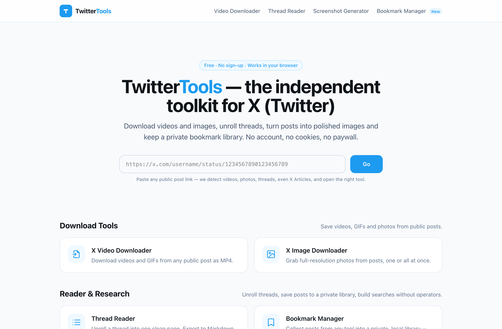
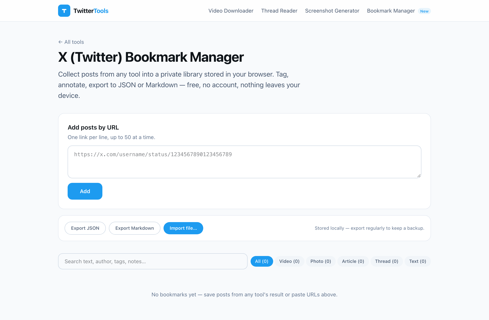

# TwitterTools

[](https://github.com/steley/twittertools/actions/workflows/ci.yml)
[](LICENSE)
[](https://twittertools.com)

A free and open-source suite of Twitter tools for X (Twitter). Ten tools, no login,
no tracking, no paid X API. Most features run directly in your browser; the server
only provides a stateless media proxy when a download needs one.

> TwitterTools is an independent project and is not affiliated with X Corp.

<p align="center">
  
</p>

## Features

### Download

- [Video Downloader](https://twittertools.com/twitter-video-downloader/) — save videos & GIFs as MP4 in every available quality, with file-size estimates
- [Image Downloader](https://twittertools.com/twitter-image-downloader/) — original-resolution photos, one at a time or all at once

### Reader & Research

- [Thread Reader](https://twittertools.com/twitter-thread-reader/) — unroll a thread into one readable page; export Markdown, TXT, HTML or PDF
- [Advanced Search Builder](https://twittertools.com/twitter-advanced-search-builder/) — build search-operator queries with a GUI, then open them on X

### Writing

- [Tweet Splitter](https://twittertools.com/tweet-splitter/) — break long text into a numbered 280-character thread using X's real counting rules
- [Character Counter](https://twittertools.com/tweet-character-counter/) — weighted counting exactly like X: CJK counts double, links always count 23
- [Font Generator](https://twittertools.com/twitter-font-generator/) — bold, italic, script and more Unicode styles for posts and bios

### Create & Share

- [Screenshot Generator](https://twittertools.com/tweet-screenshot-generator/) — render a post (or a thread with its replies) into a polished PNG card, light or dark

### Developer

- [URL & ID Parser](https://twittertools.com/tweet-url-parser/) — convert post URLs to IDs and Snowflake timestamps, and back

### Highlight: a privacy-first bookmark manager

[Bookmark Manager](https://twittertools.com/bookmark-manager/) is the most distinctive
tool in the suite — a **local-first** X bookmark library:

- No account required — your bookmarks never leave your device (IndexedDB)
- Snapshots public posts (text, media, author) so they survive deletion
- Tags, notes, search, a built-in media viewer, JSON & Markdown export
- Installable as a PWA — viewed items stay available offline

<p align="center">
  
</p>

## Demo

**https://twittertools.com** — every tool works without an account.

## Why open source?

Twitter tools often demand accounts, OAuth permissions, or opaque black-box services.
TwitterTools is open source so you can verify the opposite: nothing is tracked,
nothing is stored, and every claim on the site can be checked against the code.

## Tech Stack

Frontend:
Astro + TypeScript + Tailwind CSS (a scoped service worker powers the installable Bookmark Manager)

Backend:
Python 3.8+ (3.11+ recommended) + aiohttp. Public posts are resolved through X's
free syndication endpoint (the same one that powers embeds on publisher sites) —
no developer account, no OAuth, no per-read billing.

Tests:
vitest (frontend units) + Playwright (page smoke tests) + an offline mock suite
for the backend — all run in CI on every push.

## Self Hosting

The site is a static build (`dist/`) plus one small API service. Any host that can
reach `cdn.syndication.twimg.com`, `pbs.twimg.com` and `video.twimg.com` can run it.

### 1. Build the frontend

```bash
npm install
npm run build        # -> dist/
```

### 2. Run the API

```bash
cd server
python3 -m venv .venv && .venv/bin/pip install -r requirements.txt
.venv/bin/python downloader_server.py    # serves 127.0.0.1:8787
```

### 3. Serve it

Point a web server at `dist/` and reverse-proxy `/api/` to `127.0.0.1:8787`.
A ready-made Apache vhost example lives in [`deploy/`](deploy/).
Two rules matter:

- Point the document root at `dist/`, **never** at the repo root — that would
  expose `server/` and `deploy/` to the web.
- `video.twimg.com` 403s hotlink requests that carry a non-X `Referer`; the
  backend already sends none — don't add one back.

For production, run the API under the provided systemd unit
([`server/twittertools-api.service`](server/twittertools-api.service)) and create
its state directory first (`install -d -o www-data -g www-data /var/lib/twittertools`)
so the tweet cache can persist across restarts. If persistence fails, the backend
logs a one-time "staying memory-only" warning and keeps working.

### Configuration

| Variable | Default | Purpose |
| --- | --- | --- |
| `TT_CACHE_FILE` | next to the script (dev) | Disk path for the 10-minute tweet cache; `""` disables persistence |
| `TT_GLOBAL_TWEET_RATE` | `300/60` | Global lookup limiter, `limit/window-seconds` |
| `TT_GLOBAL_DOWNLOAD_RATE` | `120/60` | Global download limiter |
| `TT_THREAD_DOWNWALK` | `0` | `1` enables best-effort conversation down-walk (guest GraphQL) |
| `TT_MEDIA_HOSTS` | — | Extra allowed media hosts (for tests) |
| `TT_PROXY` | — | Optional outbound proxy (e.g. `socks5h://127.0.0.1:1080`) for hosts that can't reach X directly |

Per-IP limits (60 lookups/min, 40 downloads/min) are built in. Aggregate, anonymous
counters are served at `GET /api/healthz`.

### Updating

```bash
git pull && npm install && npm run build
# rsync dist/ to your web root; rsync server/ and restart the service when it changes
```

### Local development

```bash
npm run dev                                  # site on :4321, API auto-wired to :8787
cd server && .venv/bin/python mock_test.py   # offline integration suite (no network)
```

**Honest limitation:** the syndication endpoint is undocumented and has no SLA. If X
changes it, only the fetch layer in
[`server/downloader_server.py`](https://github.com/steley/twittertools/blob/main/server/downloader_server.py)
(`fetch_syndication()` / `candidate_tokens()`) needs updating — `GET /api/healthz`
shows the upstream status distribution.

## License

[MIT](LICENSE)
